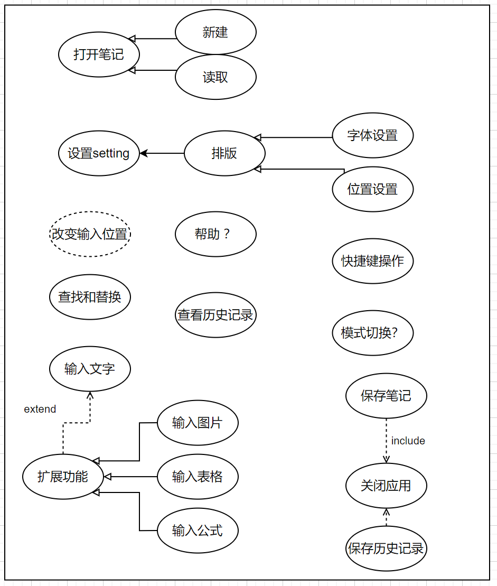
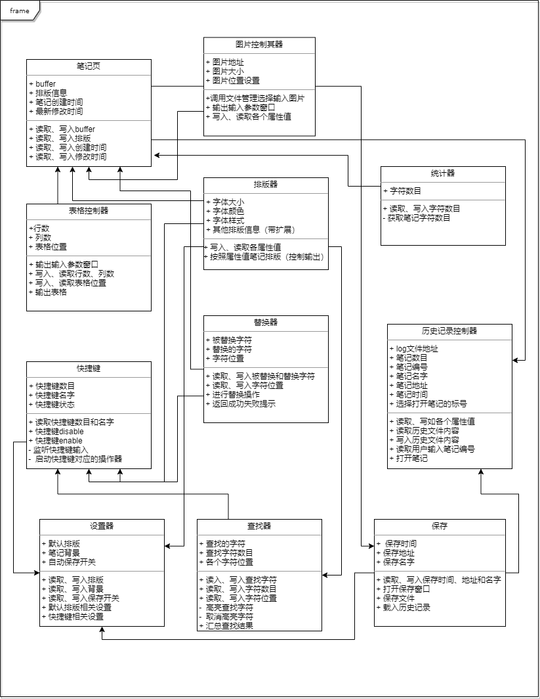

### 笔记本、便签：

#### 用例图

#### 用例分析：

##### 全过程

* 用例场景：

  在笔记应用提供的窗口上进行活动。

* 用例描述：
  1. 作者打开笔记
  2. 作者写笔记同时可使用笔记其他部分功能
     * 设置排版
     * 替换查找
     * 快捷键操作
     * 设置
     * 保存笔记
  3. 关闭笔记

##### 打开笔记

* 用例场景：

  一开始启动笔记程序

* 用例描述：

1. 作者打开笔记应用

   * 使用java提供的wing库 Jframe创建窗口

2. 选择新建空文件或者打开一个已有的文件
   * 新建文件需要使用默认排版格式
   * 读取已有文件需要读取内容。

3. 输出笔记

   

##### 设置排版

* 用例场景：

  在笔记页上进行操作

* 用例描述：

  1. 作者启动设置排版（即更改当前排版）

     * 已选中文字
     * 未选中任何文字

  2. 改变当前的排版设置

     * 做出对应的排版更改：有字体大小、颜色、字体样式（加粗、斜体）。

  3. 更新：显示笔记

##### 写笔记

* 用例场景

  在笔记页上进行操作

* 用例描述
  1.  作者选择输入图片
     * * 作者从文件管理器中查找图片输入
       * 作者图片拖拽到文件
     * 程序将图片显示到相应的位置
  2. 输入表格
     * 程序弹出窗口供作者选择表格规格
     * 程序显示表格
  3. 输入公式
     * 输入latex公式
     * 程序识别并转化成公式
     * 程序显示公式
  4. 注：目前没有想更多，之后再进行补充

##### 查找和替换

* 用例场景：

  在笔记页上进行操作

* 用例描述：
  * 作者启动查找\替换器
  * 作者一边输入查找内容
  * 查找器工作，在文件中高亮查找内容
  * 作者另一边输入替换内容
  * 替换器工作，在文件中进行替换操作
  * 程序进行替换

##### 保存笔记

* 用例场景：

  在笔记页上进行操作

* 用例描述：
  * 启动方式
    * 作者主动保存（点击提供选项按钮）
    * 程序自动保存（设置与否）：每隔多久？
  * 程序弹出文件管理器来供作者选择保存位置
  * 程序将笔记存入特定的位置

##### 快捷建操作

* 用例场景：

  在笔记页上进行操作

* 用例描述：
  * 作者输入一某一个特殊的快捷键
  * 程序进行一个相应的操作

##### 设置

* 用例场景：

  在笔记页上进行操作

* 用例描述：
  * 作者打开设置
  * 程序弹出窗口供选择
  * 笔记背景颜色、默认排版等笔记风格可供选择。
  * 设置后选择保存
  * 程序重新显示笔记

##### 关闭笔记

* 用例场景：

  在笔记页上进行操作

* 用例描述
  * 作者选择关闭程序
  * 程序询问作者是否保存笔记
    * 是：保存
    * 否：不保存
  * 直接退出程序

#### 功能提取：动词

| 功能编号 | 功能描述     | 备注                                                       |
| -------- | ------------ | ---------------------------------------------------------- |
| 001      | 新建文件     | 直接进入空白笔记                                           |
| 002      | 打开已有文件 | 文件管理器提供选择                                         |
| 003      | 显示文件     | 笔记显示                                                   |
| 004      | 设置排版     | 排版控制器修改相应的值                                     |
| 005      | 输入图片     | 图片控制器启动，弹出新窗口完成操作                         |
| 006      | 输入表格     | 表格控制器启动，弹出窗口完成操作                           |
| 007      | 输入公式     | 笔记识别启动公式控制器，自动完成输入公式操作               |
| 008      | 保存笔记     | 笔记的保存器完成                                           |
| 009      | 快捷键操作   | 快捷键控制器接受来自笔记信号并启动相应功能控制器           |
| 010      | 设置         | 设置器启动，一个新的窗口，保存着默认设置，可由作者选择改变 |
| 011      | 关闭笔记     | 关闭器控制，询问是否保存笔记                               |
| 012      | 查找         | 查找器提供，查找字符串                                     |
| 013      | 替换         | 替换器提供，替换所有的适配字符串                           |
| 014      | 高亮文字     | 可以由排版器控制完成                                       |
| 015      | 统计字数     | 统计器完成统计，笔记页显示                                 |
| 016      | 显示行数     | 统计器提供，笔记页显示                                     |
| 017      | 读取历史记录 | 作者拉去，历史记录控制器提供服务                           |
| 018      | 载入历史记录 | 作者关闭保存笔记，历史记录控制器载入记录                   |

### 关键类的提取：

笔记页、排版、图片控制器、表格控制器、公式转化器、快捷键、设置器、查找器、替换器、统计器、历史记录控制器、保存

| 类名           | 属性                                                         | 方法                                                         |
| -------------- | ------------------------------------------------------------ | ------------------------------------------------------------ |
| 笔记页         | 1. 输入内容的buffer 2. 排版信息 3. 笔记创建时间 . 最新修改时间 | 写入、读取buffer 写入、读取排版 写入、读取笔记创建时间 写入、读取笔记修改时间 |
| 排版器         | 1. 字体大小 2. 字体颜色 3. 字体样式 4. 其他排版属性（待扩展）  | 写入、读取各属性值 按照属性值笔记排版（控制输出）  |
| 图片控制器     | 1. 图片地址 2. 图片大小 3. 图片位置设置            | 调用文件管理选择输入图片 输出输入参数窗口 写入、读取各个属性值  |
| 表格控制器     | 1. 行数 2. 列数 3. 表格位置                        | 输出输入参数窗口 写入、读取行数、列数和表格位置 输出表格 |
| 公式转化器     | 1. 公式读入buffer 2. 公式输出地址                       | 写入、读取公式 调用库函数转换公式 输出公式         |
| 快捷键         | 1. 快捷键数目 2. 快捷键名字 3. 快捷键状态          | 读取快捷键数目和名字 快捷键disable 快捷键enable 监听快捷键输入 启动快捷键对应的操作器  |
| 设置器         | 1. 默认排版 2. 笔记背景 3. 自动保存开关            | 读取、写入排版 读取、写入背景 读取、写入保存开关 默认排版相关设置 快捷键相关设置  |
| 查找器         | 1. 查找的字符 2. 查找字符数目 3. 各个字符位置      | 读入、写入查找字符 读取、写入字符数目 读取、写入字符位置 高亮查找字符 汇总查找结果 |
| 替换器         | 1. 被替换字符 2. 替换的字符 3. 字符位置            | 读取、写入被替换和替换字符 读取、写入字符位置 进行替换操作 返回成功失败提示 |
| 统计器         | 1. 字符数目                                                  | 读取、写入字符数目 获取笔记字符数目                     |
| 历史记录控制器 | 1. log文件地址 2. 笔记数目 3. 笔记编号 4. 笔记名字 5. 笔记地址 6. 笔记时间 7. 选择打开笔记的标号 | 读取、写如各个属性值 读取历史文件内容 写入历史文件内容 读取用户输入笔记编号 打开笔记  |
| 保存           | 1. 保存时间 2. 保存地址 3. 保存名字                | 读取、写入保存时间、地址和名字 打开保存窗口 保存文件 载入历史记录  |

### 类图

